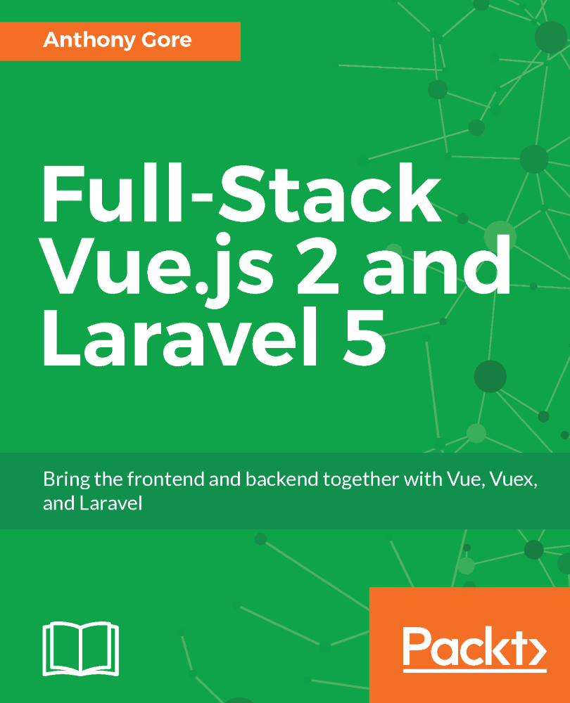
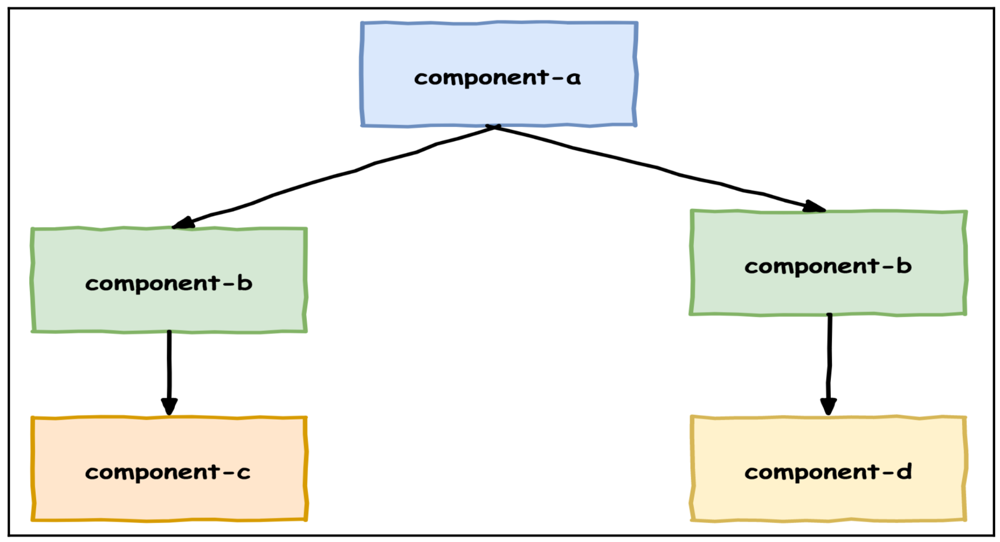
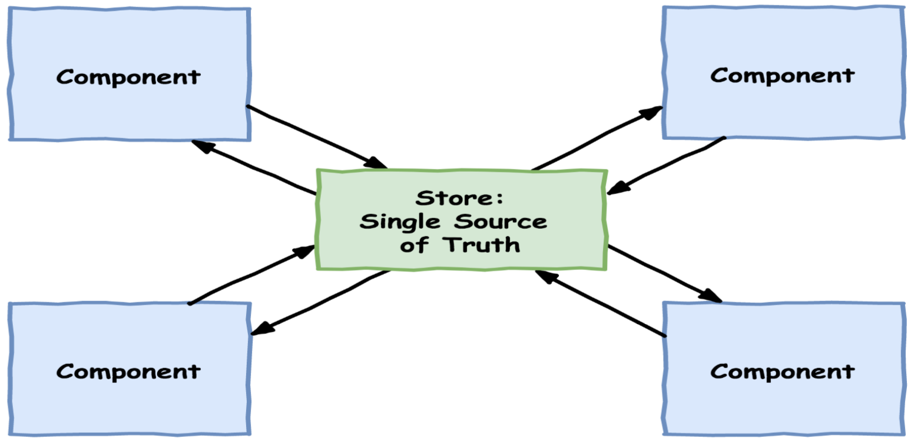
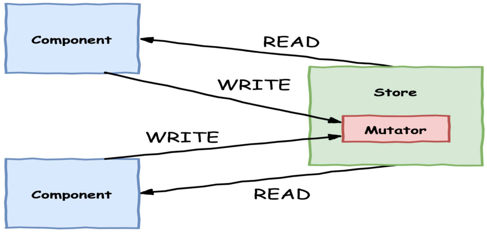

# Full Stack Vue.js 2 and Laravel 5
[{:height="36px" width="36px"}](https://www.packtpub.com/application-development/full-stack-vuejs-2-and-laravel-5)

Норм книга. Информации по Vue вполне хватит для создания средних интерфейсов, Ларавель затрагивается совсем чуть-чуть. То есть книжка про Vue, ориентирована на фронтенд. Ларавель тут просто потому, что это сложившийся стэк. Книга подойдет тем, кто начинает работать с Vue и хочет получше разобраться, как получать/хранить/менять данные на фронте.

Автор — [Anthony Gore](https://vuejsdevelopers.com/about/) из Австралии, который держит сайт [vuejsdevelopers.com](https://vuejsdevelopers.com/) со статьями, новостями и рассылкой по Vue. Автор так же ведет [курс по Vue на Udemy](https://www.udemy.com/user/anthonygore/).

Рабочий код, который получился в итоге, лежит в [`/vuebnb`](/vuebnb). Чтобы заработало, нужно запустить миграции и сервер. Как-то так:

```sh
php artisan migrate
php artisan db:seed
php artisan serve
```

В книге пошагово создается фронт для клона AirBNB:
- хомпейдж со списком квартир;
- страница квартиры;
- логинка: традиционная на отдельной странице и через API по oAuth (используется Laravel Passport);
- у пользователя есть список понравившихся квартир.

Админки нет, только морда.

## Реактивность
В [этой статье](https://vuejsdevelopers.com/2017/03/05/vue-js-reactivity/) объясняются принципы реактивности Vue. Там геттеры и сеттеры. Как только свойство в `data` меняется, срабатывают сеттеры, которые цепляют разные другие штуки и получается автообновление приложения.

## Как влиять на тег `body`
Vue-приложение хавает определенный элемент, который подменяет. Вот это вот в инициализации: `el: '#app'`. А если надо добавить `body` класс, когда мы хотим модальное окно показать, чтоб боди не скроллилось?

Это можно сделать через вотчеры. Вотчеры так же следят за именением состояния и в них можно манипулировать DOM как обычно, через API браузера.


## 4. Building a Web Service with Laravel
### Facade pattern
In Laravel, schemas are declared by using the `Schema` facade's `create` method.

A facade is an object-oriented design pattern for creating a static proxy to an underlying class in the service container. The facade is not meant to provide any new functionality; its only purpose is to provide a more memorable and easily readable way of performing a common action. Think of it as an object-oriented helper function.

### Eloquent
How do we tell the ORM what table to map to, and what columns to include? By default, the Model class uses the class name (Listing) in lowercase (listing) as the table name to use. And, by default, it uses all the fields from the table.

## 5. Integrating Laravel and Vue.js with Webpack

[core-js](https://github.com/zloirock/core-js) — полифил с современным JS.

## 6. Composing Widgets with Vue.js Components
In fact, each component can be thought of as a mini-instance of Vue with its own data, methods, lifecycle hooks, and so on.

Неправильно. Так `data` для всех компонентов будет одна и та же:

```js
<div id="app">
     <check-box></check-box>
     <check-box></check-box>
     <check-box></check-box>
</div>
<script>
 Vue.component('check-box', {
   template: '<div v-on:click="checked = !checked"></div>'
   data: {
     checked: false
   }
 });
</script>
```

### Props
However, you should not mutate prop data. Think of prop data as being borrowed from another component or instance - only the owner should change it.

### Slots
Слоты используют, когда один и тот же компонент (Component B) может содержать разные дочерние компоненты:


Component B может выглядет так:

```js
Vue.component('component-b', {
     template: '<slot></slot>'
});
```

И теперь внутри него можно юзать другие компоненты:

```html
<component-a>
    <component-b>
        <component-c></component-c>
    </component-b>
    <component-b>
        <component-d></component-d>
    </component-b>
</component-a>
```

### Scoped slots
Scoped slots allow you to pass a template to the slot instead of passing a rendered element.

`v-bind` without an argument will bind the properties of an entire object to the element.

`render`-функцию обычно применяют в родительских компонентах. Так мы не отдаем инстансу Vue шаблон, а отдаем готовую функцию, собранную Вебпаком. Это быстрее и менее затратно. И если Vue не нужно парсить темплейты, то можно юзать версию фреймворка без парсера шаблонов.

## 7. Building a Multi-Page App with Vue Router
With Vue Router, different pages of the application are represented by different components:

```js
let routes = [
     { path: '/', component: HomePage },
     { path: '/about', component: AboutPage },
     { path: '/contact', component: ContactPage }
];
```

### Creating routes
There are two modes for Vue Router: hash mode and history mode. Hash mode uses the URL hash to simulate a full URL so that the page won't be reloaded when the hash changes. History mode has real URLs and leverages the history.pushState API to change the URL without causing a page reload. The only downside to history mode is that URLs outside of the app, such as `/some/weird/path`, can't be handled by Vue and must be handled by the server. That's no problem for us, so we'll use history mode for Vuebnb.

## 8. Managing application state with Vues
### Flux Architecture
1. Единственный источник правды. Каждый компонент содержит внутри себя данные о своем собственном состоянии, но данные, касающиеся других компонентов лежат в Сторе. Все компоненты берут данные из него:



2. Данные доступны только для чтения. Компоненты могут читать данные, но **не могут записывать их напрямую**. Компоненты информируют Стор о своих намерениях что-то изменить через мутаторы:



3. Все мутации синхронны. Иначе не получится поддерживать порядок.

### Vuex
Vuex includes a store with state and mutator methods, and will reactively update any components that are reading data from the store.

### Mutator method
Стейт из компонентов меняем только через мутаторы. Мутаторы создаются в Сторе (Мутатор — это метод в свойстве `mutations` стора):

```js
export default new Vuex.Store({
    state: {
        saved: []
    },
    mutations: {
        toggleSaved(state, id) {
            let index = state.saved.findIndex(saved => saved === id);

            if (index === -1) {
              state.saved.push(id);
            } else {
              state.saved.splice(index, 1);
            }
        }
    }
});
```

В мутаторы первым аргументом приходит стейт стора, вторым — пейлоад из компонента (то, что надо будет менять). Чтобы запустить мутацию, из компонента нужно закомитить изменение: `this.$store.commit('toggleSaved', this.id)`.

### Getters
В сторе можно собирать разрозненные данные. Можно создавать геттеры — это как `computed`-свойства, только в Сторе. Обычно их делают, когда нескольким компонентам нужно достать вычилимые значения из нескольких полей:

```js
state: {
     saved: [5, 10],
     listing_summaries: [ ... ]
    },
    getters: {
     savedSummaries(state) {
       return state.listing_summaries.filter(
         item => state.saved.indexOf(item.id) > -1
       );
    }
}
```

One thing about getters is that they don't accept a payload argument like mutations do. If you want to pass a value to a getter, you need to return a function where the payload is an argument of that function.

## 9. Adding a User Login and API Authentication with Passport
### Vuex actions
Если в мутаторе нужно выполнить асинхронное действие (аякс), то нужно юзать экшны.

Actions are like mutations, but instead of mutating the state, they commit mutations. For example:

```js
var store = new Vuex.Store({
    state: {
        val: null
    },
    
    mutations: {
        assignVal(state, payload) {
            state.val = payload;
        }
    },
    
    actions: {
        setTimeout(() => {
            commit('assignVal', 10);
        }, 1000)
    }
});
       
store.dispatch('assignVal', 10);
```   
   
By abstracting asynchronous code into actions we can still centralize any state-altering logic in the store without tainting our application data through race conditions.

## 10 Deploying a Full-Stack App to the Cloud
https://devcenter.heroku.com/articles/getting-started-with-laravel#setting-a-laravel-encryption-key
